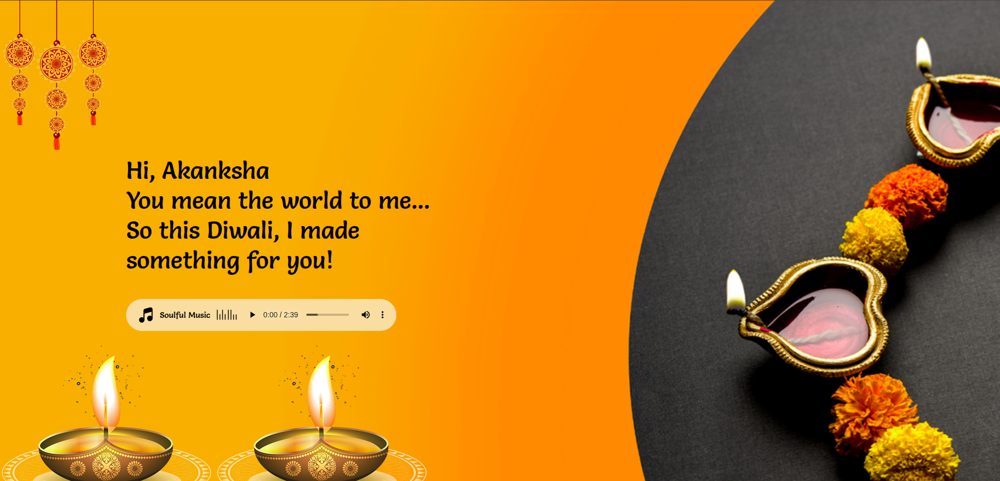
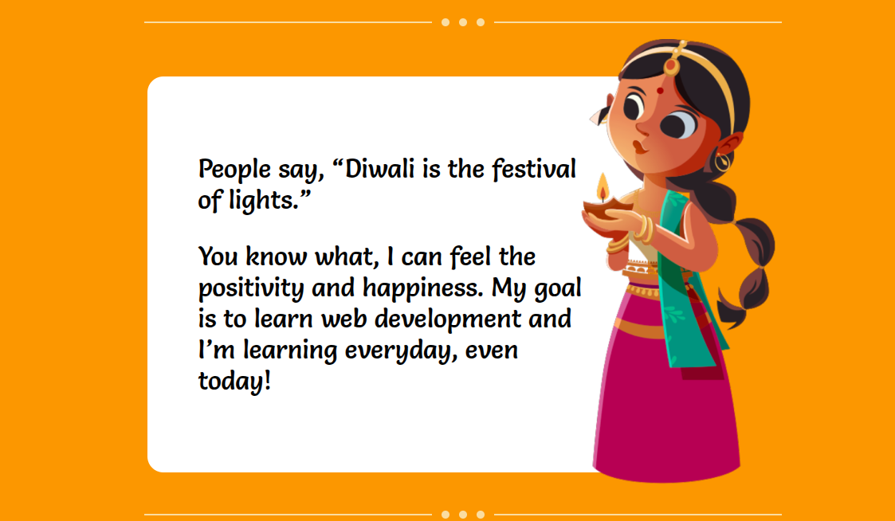
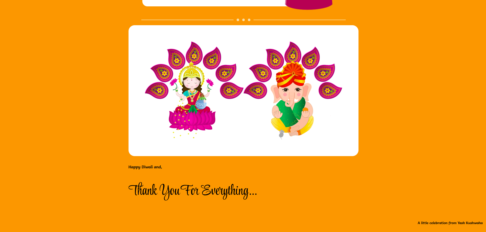

# 🪔 Happy Diwali Greeting Web Page

A warm, colorful, and responsive Diwali greeting web page built using only **HTML**, **CSS**, and a sprinkle of JavaScript. Personalize your greeting by sharing a unique link with custom names using URL parameters like `?sender=Yash&receiver=Friend`.

## ✨ Features

- Responsive festive layout with traditional colors and illustrations  
- Personalized names using URL parameters (`sender` & `receiver`)  
- Custom fonts from Google Fonts  
- Embedded background music with styled controls  
- Clean CSS animations and visual separators  

---

## 📸 Screenshots

<table>
  <tr>
    <td align="center">
      
    </td>
    <td align="center">
      
    </td>
  </tr>
  <tr>
    <td align="center">
      
    </td>
    <td align="center">
      
    </td>
  </tr>
</table>

---

## 🔗 Live Demo

[🎉 Open Greeting Page](https://your-live-site-link.com)

You can customize it like this:  
`https://your-live-site-link.com?sender=Yash&receiver=Bestie`

---

## 🛠️ Technologies Used

- HTML5  
- CSS3 (Flexbox, Media Queries)  
- Google Fonts (`Salsa`, `Style Script`)  
- Audio Element + Custom Styling  
- JavaScript DOM API (for dynamic name rendering)

---

## 📚 Inspiration

This project combines front-end design skills with festive spirit. Inspired by personalized greeting cards and India's vibrant Diwali culture.

---

## 👤 Author

<table width="100%">
  <tr>
    <td align="left">
      <h3>Yash Kushwaha</h3>
    </td>
    <td align="right">
      
      
      
      
      
      
    </td>
  </tr>
</table>

- GitHub: [alwaysyash616](https://github.com/alwaysyash616)  
- Frontend Mentor: [@alwaysyash616](https://www.frontendmentor.io/profile/alwaysyash616)  
- Instagram: [@alwaysyash616](https://www.instagram.com/alwaysyash616)  
- Facebook: [@alwaysyash616](https://www.facebook.com/alwaysyash616)  
- LinkedIn: [@alwaysyash616](https://www.linkedin.com/in/alwaysyash616)  
- Telegram: [@alwaysYash616](https://t.me/alwaysYash616)  
- Email: yash274602@gmail.com

---

## 🙏 Thank You

Wishing you peace, prosperity, and light.  
✨ Happy Diwali! ✨  
