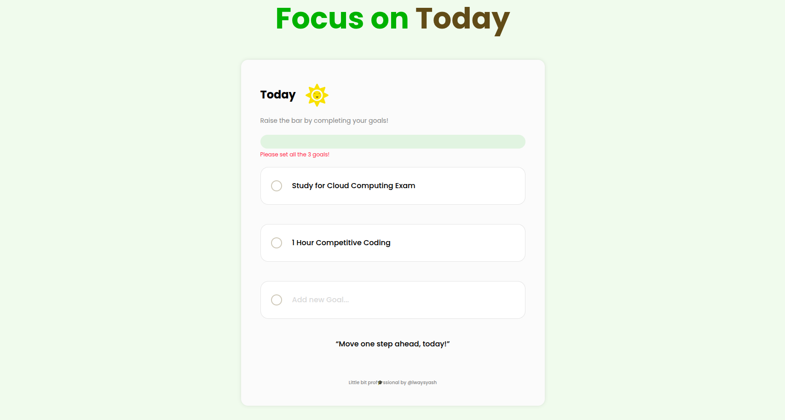

# 🎯 Focus on Today – Goal Tracker Web App

A clean, responsive, and motivational daily goals web app built using **HTML**, **CSS**, and **JavaScript**. Track and mark your 3 daily goals, and stay inspired with dynamic progress feedback and motivational quotes—all saved locally in your browser using `localStorage`.

---

## ✨ Features

- Minimalist and responsive design  
- Interactive checkboxes with goal completion logic  
- Progress bar that updates in real-time  
- Motivational quotes based on your progress  
- Smart localStorage integration (auto-saves your goals and their completion state)  
- Error handling when fields are empty  

---

## 📸 Screenshots

<table>
  <tr>
    <td align="center">
      
    </td>
  </tr>
</table>

---

## 🔗 Live Demo

[🚀 Open Goal Tracker](https://your-live-site-link.com)

Example use:  
Track your 3 most important goals of the day, mark them complete, and let the UI reflect your progress visually.

---

## 🛠️ Technologies Used

- **HTML5**  
- **CSS3** (Flexbox, Media Queries)  
- **Google Fonts** (`Poppins`)  
- **JavaScript** (DOM manipulation, `localStorage`, event handling)

---

## 📚 Inspiration

This project is inspired by productivity techniques like *The Rule of 3* and *Focus Planning*. The idea is to limit your daily scope to just **three high-impact goals** and measure progress meaningfully.

---

## 👤 Author

<table width="100%">
  <tr>
    <td align="left">
      <h3>👤 Author</h3>
    </td>
    <td align="right">
      
      
      
      
      
      
    </td>
  </tr>
</table>

- GitHub: [alwaysyash616](https://github.com/alwaysyash616)  
- Frontend Mentor: [@alwaysyash616](https://www.frontendmentor.io/profile/alwaysyash616)  
- Instagram: [@alwaysyash616](https://www.instagram.com/alwaysyash616)  
- Facebook: [@alwaysyash616](https://www.facebook.com/alwaysyash616)  
- LinkedIn: [@alwaysyash616](https://www.linkedin.com/in/alwaysyash616)  
- Telegram: [@alwaysYash616](https://t.me/alwaysYash616)  
- Email: yash274602@gmail.com  

---

## 🙌 A Note of Encouragement

"Move one step ahead, today!"  
Keep your focus simple and sharp. Every small win counts. 💪
