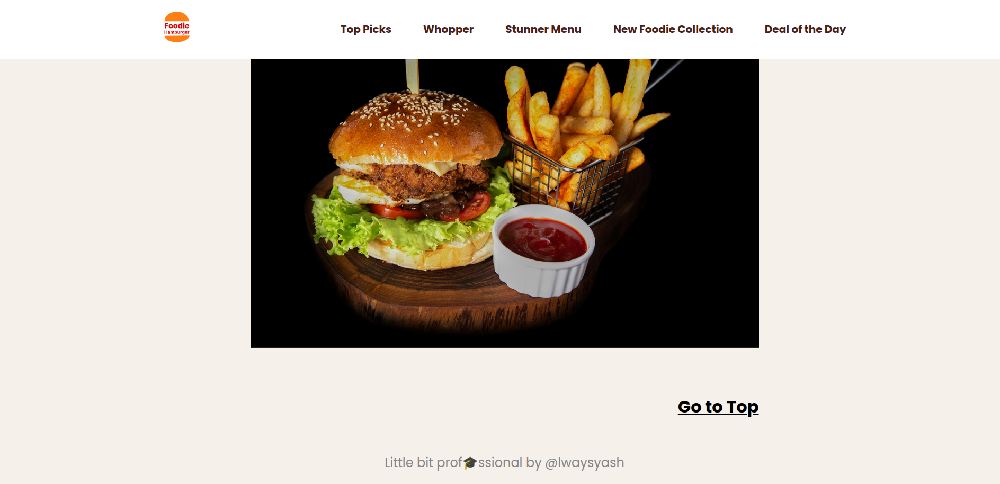

# 🍔 Foodie Hamburger – Responsive Burger Menu Web App

A deliciously crafted **responsive burger menu website** built using **HTML**, **CSS**, and **JavaScript**. Explore various burger categories, toggle navigation with a mobile-friendly hamburger menu, and enjoy smooth animations—all topped with a flavorful UI.

---

## ✨ Features

- Fully responsive and mobile-optimized layout  
- Hamburger menu with slide-in animation and overlay handling  
- Sticky navigation bar with adaptive padding  
- Scrollable anchor links to each burger category  
- Smooth transition effects and interactivity  
- Clean, semantic HTML and modern CSS practices  
- Google Fonts integration with Poppins font  
- Event-driven `menu-open` toggle logic using pure JavaScript  

---

## 📸 Screenshots

<table>
  <tr>
    <td align="center">
      
    </td>
    <td align="center">
      
    </td>
  </tr>
  <tr>
    <td align="center">
      
    </td>
    <td align="center">
      
    </td>
  </tr>
</table>

---

## 🔗 Live Demo

[🚀 Try the Foodie Hamburger App](https://always-foodie-hamburger.netlify.app/)

Discover handcrafted burger sections such as **Top Picks**, **Whopper**, **Stunner Menu**, and more. Ideal for mock food delivery concepts, responsive UI showcases, and modern design demos.

---

## 🛠️ Technologies Used

- **HTML5** – Semantic layout with accessibility considerations  
- **CSS3** – Flexbox, media queries, animations  
- **Google Fonts** – [Poppins](https://fonts.google.com/specimen/Poppins)  
- **JavaScript** – Hamburger toggle logic, event bubbling control  

---

## 📚 Inspiration

This project simulates a **modern fast-food website landing page**, focusing on **clean UI**, **ease of navigation**, and **adaptive design** principles. The goal is to reflect the aesthetics of real-world brands while keeping the codebase simple and maintainable.

---

## 👤 Author

<table width="100%">
  <tr>
    <td align="left">
      <h3>👤 Author</h3>
    </td>
    <td align="right">
      
      
      
      
      
      
    </td>
  </tr>
</table>

- GitHub: [alwaysyash616](https://github.com/alwaysyash616)  
- Frontend Mentor: [@alwaysyash616](https://www.frontendmentor.io/profile/alwaysyash616)  
- Instagram: [@alwaysyash616](https://www.instagram.com/alwaysyash616)  
- Facebook: [@alwaysyash616](https://www.facebook.com/alwaysyash616)  
- LinkedIn: [@alwaysyash616](https://www.linkedin.com/in/alwaysyash616)  
- Telegram: [@alwaysYash616](https://t.me/alwaysYash616)  
- Email: yash274602@gmail.com  

---

## 🙌 Bon Appétit!

> “Well, you can’t resist anymore!” — Dive into a UI experience as tasty as the burgers it displays.  
Simple yet flavorful. Ideal for showcasing front-end dev and responsive design chops. 🍟
