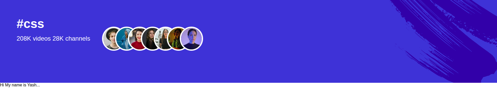

# 📺 YouTube Hashtag Header Clone

A simple clone of the YouTube hashtag section built using HTML and CSS. This includes a responsive layout, overlapping circular user images, and a background image — replicating the YouTube-style hashtag header.

## 📸 Screenshot

## 🔗 Live Preview

[🔗 View Live Site](https://yt-header-component.netlify.app/)

## 🚀 Built With

- HTML5  
- CSS3 (Flexbox, background positioning)  
- Mobile-first workflow

## 🧠 What I Learned

- Used `flex-direction: row-reverse` for right-aligned image stacking.  
- Achieved circular overlapping profile images using `border-radius` and `margin-left`.  
- Applied layered background image techniques for responsive design.

## 🔮 Continued Development

- Make image container overlap more dynamic with JS-based avatars.  
- Improve responsiveness using media queries.  
- Add animations on hover for a more modern effect.

## 📚 Useful Resources

- [📘 CSS Tricks - Flexbox Guide](https://css-tricks.com/snippets/css/a-guide-to-flexbox/)  
- [📘 MDN - background-position](https://developer.mozilla.org/en-US/docs/Web/CSS/background-position)  
- [📘 CSS Circular Images](https://css-tricks.com/how-to-create-a-circle-image/)

## 👤 Author

<table width="100%">
  <tr>
    <td align="left">
      <h3>Yash Kushwaha</h3>
    </td>
    <td align="right">
      
      
      
      
      
      
    </td>
  </tr>
</table>

- GitHub: [alwaysyash616](https://github.com/alwaysyash616)  
- Frontend Mentor: [@alwaysyash616](https://www.frontendmentor.io/profile/alwaysyash616)  
- Instagram: [@alwaysyash616](https://www.instagram.com/alwaysyash616)  
- Facebook: [@alwaysyash616](https://www.facebook.com/alwaysyash616)  
- LinkedIn: [@alwaysyash616](https://www.linkedin.com/in/alwaysyash616)  
- Telegram: [@alwaysYash616](https://t.me/alwaysYash616)  
- Email: yash274602@gmail.com
