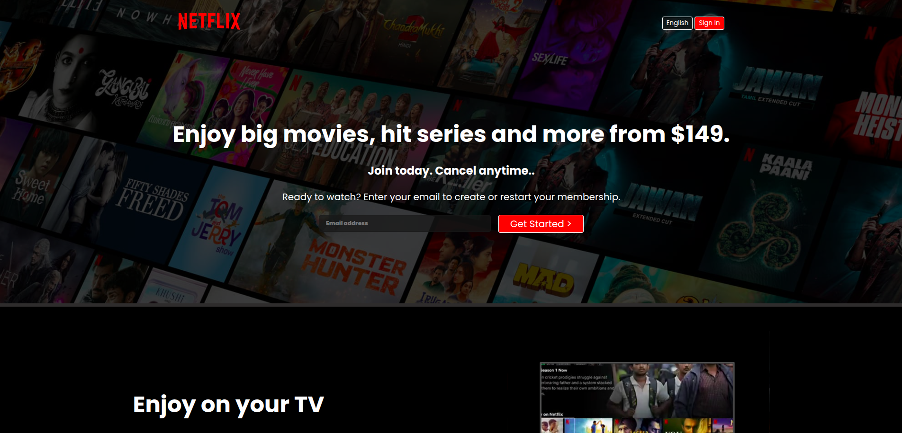
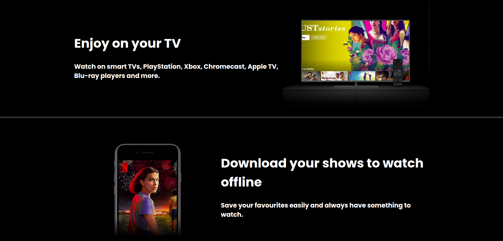
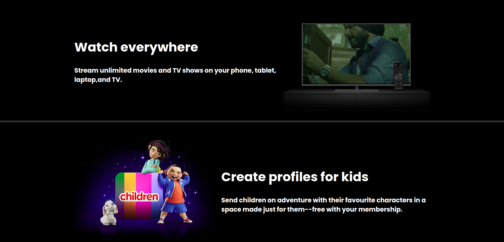
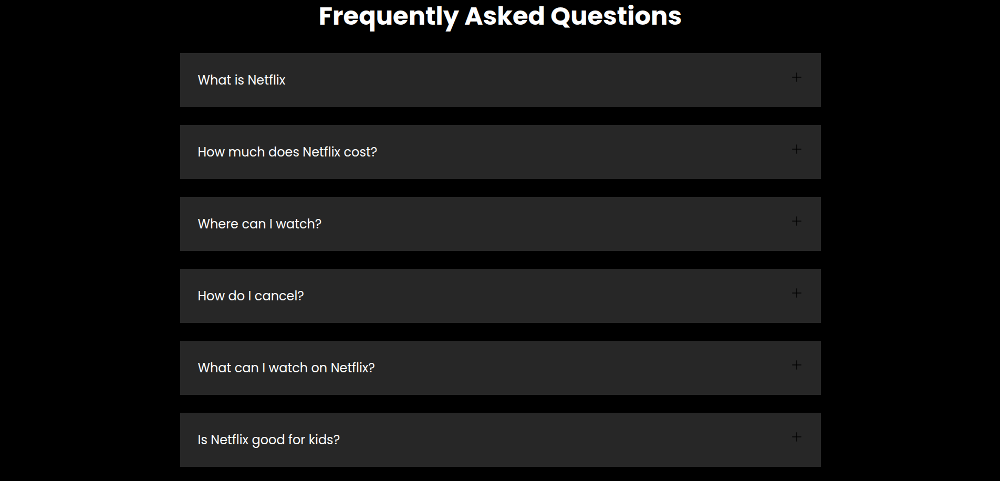
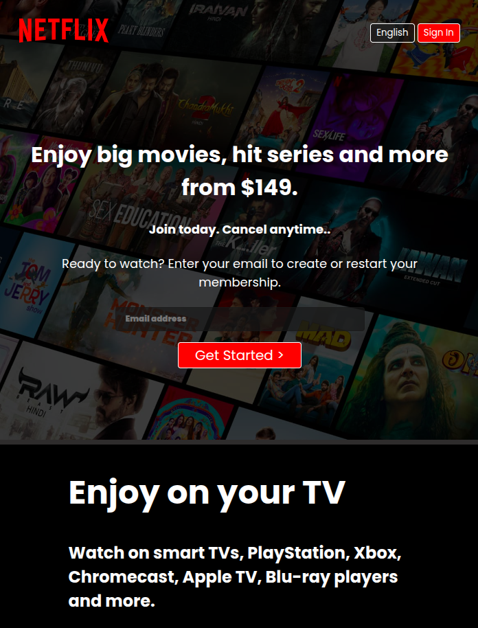
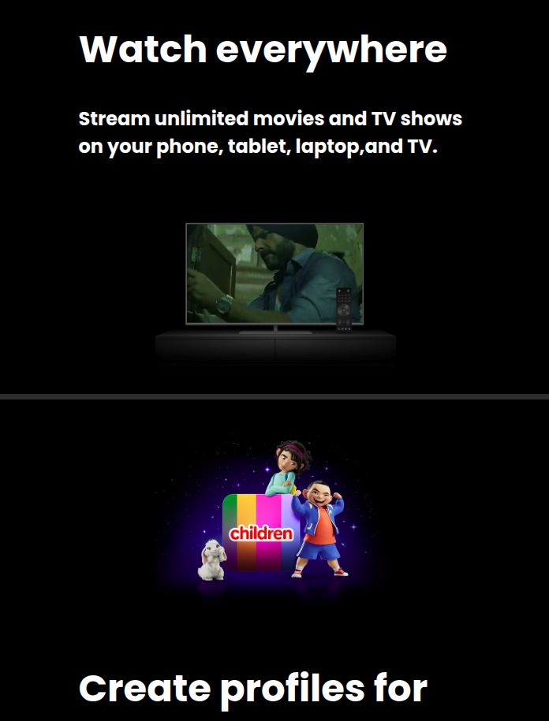
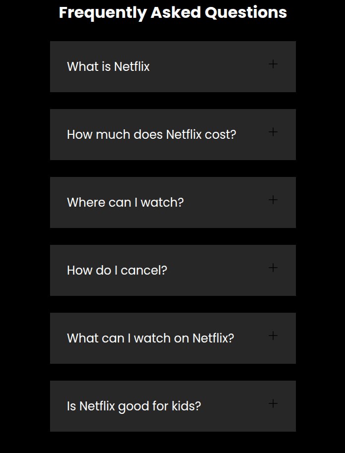

<h1 align="center">
   Netflix India Clone 🍿
</h1>

<p align="center">
  A responsive front-page clone of <strong>Netflix India</strong>, built using HTML and CSS. This project focuses on pixel-perfect replication of Netflix's UI/UX — including hero sections, multimedia overlays, CTA forms, and FAQs — to enhance your front-end web development skills.
</p>

<p align="center">
  
</p>

---

## 🍔 Table of Contents

- [🌐 Live Demo](#-live-demo)
- [📸 Screenshots](#-screenshots)
- [🚀 Features](#-features)
- [🧰 Built With](#-built-with)
- [📁 Folder Structure](#-folder-structure)
- [🖱️ How to Use](#-how-to-use)
- [🎨 UI Highlights](#-ui-highlights)
- [📱 Responsive Design](#-responsive-design)
- [🙋 FAQ](#-faq)
- [🧑‍💻 Author](#-author)
- [📜 License](#-license)

---

## 🌐 Live Demo

🚀 **Live Preview**: [View Project on GitHub Pages](https://alwaysflix.netlify.app/)  
🌍

---

## 📸 Screenshots

<div align="center" style="display: grid; grid-template-columns: repeat(auto-fit, minmax(240px, 1fr)); gap: 20px; justify-items: center; align-items: center;">

  

  

  

  

  

  

  

</div>

---

## 🚀 Features

- 🎨 Clean, responsive design inspired by [Netflix India](https://www.netflix.com/in/)
- 📺 Embedded autoplaying videos in device mockups
- 📱 Fully responsive on mobile, tablet, and desktop
- 💬 FAQ accordion section styled for interaction
- 🧭 Sticky top navigation with logo and language selector
- ✉️ CTA with email input for user subscription

---

## 🧰 Built With

| Technology | Purpose |
|------------|---------|
| HTML5 | Structure and content |
| CSS3 | Layout, media queries, styling, and responsiveness |
| Google Fonts | Typography with `Poppins` and `Martel Sans` |
| Flexbox/Grid | Responsive layout systems |
| Media Queries | Breakpoint adjustments for mobile and tablets |

---

## 📁 Folder Structure

```bash
netflix-clone/
├── assets/
│   ├── images/
│   │   ├── bg.jpg
│   │   ├── logo.svg
│   │   ├── tv.png
│   │   ├── mobile-0819.jpg
│   │   └── kids.png
│   ├── videos/
│   │   ├── video-tv-in-0819.m4v
│   │   └── video-devices-in.m4v
├── index.html
└── style.css
```
---

## 👤 Author

<table width="100%">
  <tr>
    <td align="left">
      <h3>Yash Kushwaha</h3>
    </td>
    <td align="right">
      <a href="mailto:yash274602@gmail.com"></a>
      <a href="https://www.instagram.com/alwaysyash616"></a>
      <a href="https://www.facebook.com/alwaysyash616"></a>
      <a href="https://www.linkedin.com/in/alwaysyash616"></a>
      <a href="https://t.me/alwaysYash616"></a>
      <a href="https://github.com/alwaysyash616"></a>
    </td>
  </tr>
</table>

- GitHub: [alwaysyash616](https://github.com/alwaysyash616)  
- Frontend Mentor: [@alwaysyash616](https://www.frontendmentor.io/profile/alwaysyash616)  
- Instagram: [@alwaysyash616](https://www.instagram.com/alwaysyash616)  
- Facebook: [@alwaysyash616](https://www.facebook.com/alwaysyash616)  
- LinkedIn: [@alwaysyash616](https://www.linkedin.com/in/alwaysyash616)  
- Telegram: [@alwaysYash616](https://t.me/alwaysYash616)  
- Email: yash274602@gmail.com  

---

## 🙌 A Note of Encouragement

"Move one step ahead, today!"  
Keep your focus simple and sharp. Every small win counts. 💪
