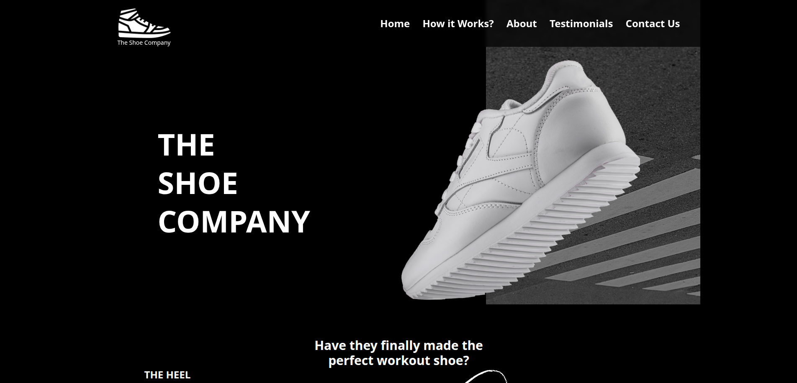
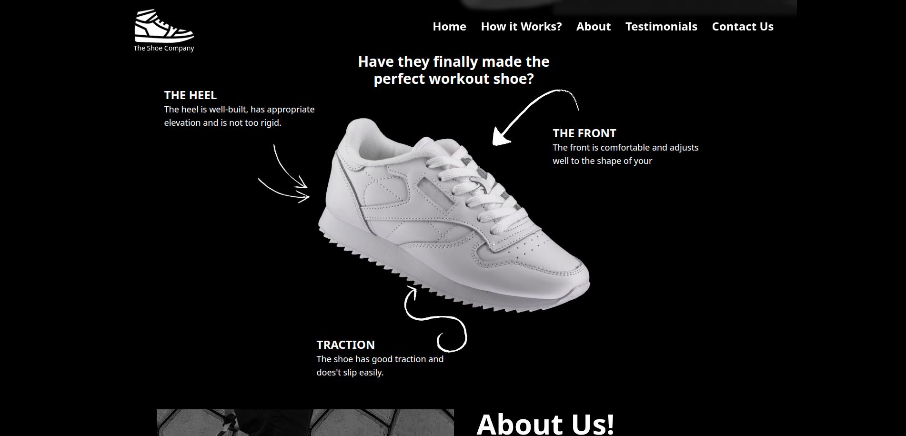
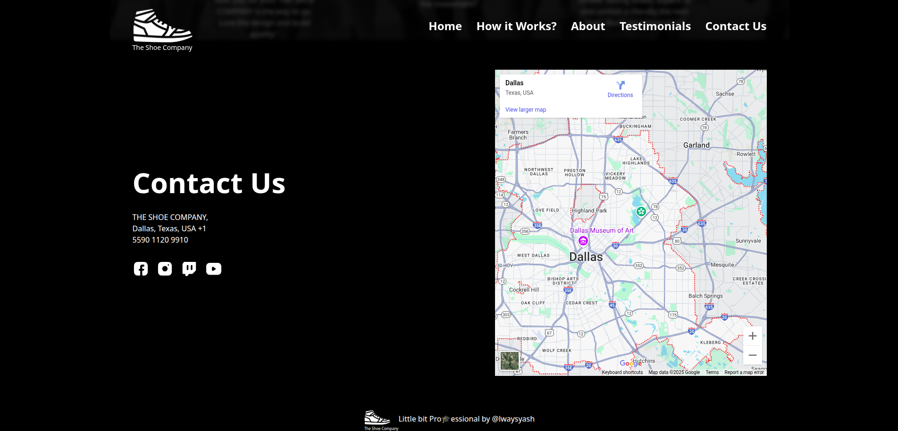

#  The Shoe Company

A stylish, responsive, and modern website showcasing premium quality athletic shoes — crafted with Tailwind CSS and designed for performance.

---

## 📁 Project Directory Structure

```
the-shoe-company/
│
├── images/
│   ├── logo.png
│   ├── hero-background.png
│   ├── hero-image.png
│   ├── about-us-background.png
│   ├── about-shoe-company.png
│   ├── how-it-works.png
│   ├── arrow-1.png
│   ├── arrow-2.png
│   ├── arrow-3.png
│   ├── testimonial-1.png
│   ├── testimonial-2.png
│   ├── testimonial-3.png
│   ├── facebook.svg
│   ├── instagram.svg
│   ├── twitch.svg
│   ├── youtube.svg
│   └── testimonial-section-background.png
│
├── preview/
│   ├── screenshot-1.png
│   ├── screenshot-2.png
│   └── screenshot-3.png
│
├── index.html
├── input.css
├── output.css (generated)
└── tailwind.config.js
```

---

## 🚀 Getting Started

To run the project locally:

1. Clone the repository.
2. Make sure [Tailwind CLI](https://tailwindcss.com/docs/installation) is installed.
3. Run Tailwind CLI to generate `output.css`:

```bash
npx tailwindcss -i ./input.css -o ./output.css --watch
```

4. Open `index.html` in your browser.

---

## 🖼️ Screenshots

<table>
  <tr>
    <td align="center">
      
    </td>
    <td align="center">
      
    </td>
  </tr>
  <tr>
    <td align="center" colspan="2">
      
    </td>
  </tr>
</table>

---

## 💡 Features

- Fully responsive layout
- Fixed navigation header with hamburger menu
- Modern hero section with layered content
- Scroll-smooth behavior
- Clean Tailwind utility-first styling
- Image-based testimonials
- Embedded Google Maps for contact section

---

## 🛠️ Tech Stack

- HTML5
- Tailwind CSS
- Google Maps Embed API

---

## 📬 Contact

**The Shoe 👟 Company**  
Dallas, Texas, USA  
📞 +1 5590 1120 9910  

---

## 📜 License

This project is licensed for personal or academic use. Commercial usage requires permission from the author.

---

> 💡 _“Little bit Pro🎓essional by @lwaysyash”_
---

## 👤 Author

<table width="100%">
  <tr>
    <td align="left">
      <h3>Yash Kushwaha</h3>
    </td>
    <td align="right">
      <a href="mailto:yash274602@gmail.com"></a>
      <a href="https://www.instagram.com/alwaysyash616"></a>
      <a href="https://www.facebook.com/alwaysyash616"></a>
      <a href="https://www.linkedin.com/in/alwaysyash616"></a>
      <a href="https://t.me/alwaysYash616"></a>
      <a href="https://github.com/alwaysyash616"></a>
    </td>
  </tr>
</table>

- GitHub: [alwaysyash616](https://github.com/alwaysyash616)  
- Frontend Mentor: [@alwaysyash616](https://www.frontendmentor.io/profile/alwaysyash616)  
- Instagram: [@alwaysyash616](https://www.instagram.com/alwaysyash616)  
- Facebook: [@alwaysyash616](https://www.facebook.com/alwaysyash616)  
- LinkedIn: [@alwaysyash616](https://www.linkedin.com/in/alwaysyash616)  
- Telegram: [@alwaysYash616](https://t.me/alwaysYash616)  
- Email: yash274602@gmail.com  

---